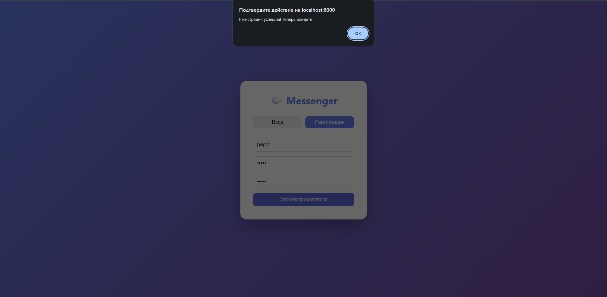
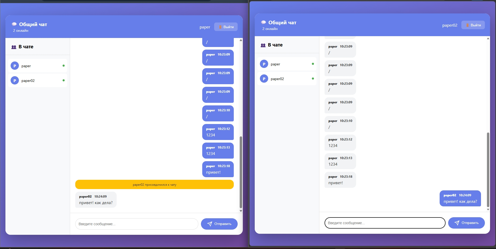

    Real-time Messenger

 Многопользовательский чат с обменом сообщениями в реальном времени, построенный на FastAPI, WebSocket и PostgreSQL. Проект полностью контейнеризирован и готов к масштабированию.

    Возможности

- **Регистрация и аутентификация** пользователей с хешированием паролей (bcrypt)
- **Обмен сообщениями в реальном времени** через WebSocket соединения
- **История сообщений** - последние 50 сообщений загружаются при подключении
- **Список онлайн-пользователей** в реальном времени
- **Системные уведомления** о подключении/отключении пользователей
- **Метрики Prometheus** для мониторинга производительности
- **Визуализация метрик** через Grafana
- **Контейнеризация** с помощью Docker и Docker Compose
- **Готовность к Kubernetes** с манифестами развертывания

    Технологии

### Backend
- **FastAPI** - асинхронный веб-фреймворк
- **WebSocket** - для real-time коммуникации
- **PostgreSQL** - основная база данных
- **SQLAlchemy** - ORM для работы с БД
- **bcrypt** - хеширование паролей
- **Prometheus Client** - метрики приложения
- **Uvicorn** - ASGI сервер

### Инфраструктура
- **Docker & Docker Compose** - контейнеризация
- **Nginx** - reverse proxy
- **Redis** - кэширование (в перспективе)
- **Prometheus** - сбор метрик
- **Grafana** - визуализация метрик
- **Kubernetes** - оркестрация (манифесты готовы)

### Frontend
- **HTML5/CSS3** - интерфейс
- **JavaScript (ES6+)** - клиентская логика
- **WebSocket API** - real-time соединение
- **Адаптивный дизайн** - градиентный фон, современный UI

